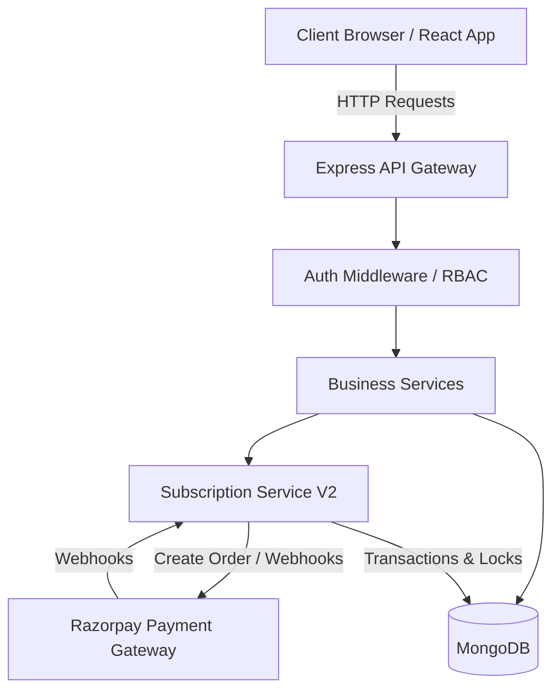

# Technical Requirements Document (TRD)

## 1. Executive Summary
The Smitox platform is built on a modern MERN-like stack tailored for robust E-commerce capabilities. It leverages a monolithic API gateway for backend services, backed by MongoDB for structured yet flexible data storage, and a React-based frontend. A key architectural pillar is the production-grade Seller Subscription System, which introduces transactional safety, idempotent webhook processing, and distributed locking to ensure absolute reliability in payment and subscription state changes.

---

## 2. Recommended Tech Stack

| Component | Technology | Reasoning |
|-----------|------------|-----------|
| **Frontend** | React 18.x, Context API, TailwindCSS | High component reusability, robust state management, and modern CSS utility classes for rapid UI iteration. |
| **Backend** | Node.js, Express.js | Event-driven, non-blocking I/O model well-suited for handling concurrent API requests from multiple users. |
| **Database** | MongoDB + Mongoose ODM | Flexible schema design is ideal for complex product catalogs, with support for ACID transactions for critical subscription operations. |
| **Authentication** | JWT (JSON Web Tokens) | Stateless authentication scaling well across distributed environments. |
| **Payments** | Razorpay | Standard, reliable payment gateway in India, supporting complex subscription and B2B transaction flows. |
| **File Storage** | ImageKit | Optimized image delivery and on-the-fly transformations, crucial for a catalog-heavy e-commerce platform. |
| **PDF Generation** | jsPDF | Client-side/Server-side generation of wholesale invoices directly from order data. |

---

## 3. System Architecture

The architecture follows a standard 3-tier client-server model:

### Client Layer (React)
Handles user interfaces for Buyers, Sellers, and Admins. State is managed via Context API and Custom Hooks. Interacts with the backend via Axios HTTP client.

### API Layer (Express.js)
Serves as the gateway for all client requests. Implements rate limiting, CORS, JWT-based authentication, and role-based access control (RBAC).

### Service & Controller Layer
Houses the core business logic.
- **Controllers:** Map routes to business logic (e.g., `productController`, `authController`).
- **Services:** Dedicated business services, notably the `subscriptionServiceV2` for managing the complex state machine of seller subscriptions, handling Razorpay webhook reconciliation, and managing distributed locks.

### Data Layer (MongoDB)
Stores all entity data. Utilizes MongoDB transactions for multi-document operations, ensuring data integrity during payment verification and subscription activation.

---

## 4. Architecture Diagram

---

## 5. Database Design (Key Models)

### User Model
- **Fields:** `_id`, `name`, `email` (unique), `password` (hashed), `role` (enum: user, admin, seller), `isActive`.
- **Purpose:** Core identity for all actors on the platform.

### Product Model
- **Fields:** `_id`, `name`, `slug` (unique), `price`, `stock`, `category` (ref), `bulkProducts` (array of minimum, maximum, selling_price_set).
- **Purpose:** Stores product details including the critical multi-tier bulk pricing arrays.

### Order Model
- **Fields:** `orderId` (unique), `buyer` (ref: User), `products` (array), `totalAmount`, `paymentMethod` (enum), `orderStatus` (enum).
- **Purpose:** Tracks buyer orders throughout the fulfillment lifecycle.

### SellerApplication & SellerProfile
- **Fields:** `status`, `selectedPlanId`, `planStartDate`, `stateHistory`, `payment`.
- **Purpose:** Implements the state machine for onboarding sellers and tracking subscription status.

---

## 6. Security & Reliability Patterns

### Idempotent Webhook Processing
Razorpay webhooks (`payment.captured`, `payment.failed`) are processed idempotently. A `WebhookEvent` collection tracks processed `eventId`s. If a duplicate webhook arrives, it is safely ignored, preventing double-activation of subscriptions.

### Distributed Locking
Implemented via a `DistributedLock` MongoDB collection. Before modifying critical state (like activating a subscription), a lock is acquired using a unique key. This prevents race conditions if the synchronous client request and the asynchronous Razorpay webhook arrive simultaneously.

### Transaction Safety
Multi-document updates (e.g., updating `SellerApplication`, creating `SellerProfile`, and updating `User` role) are wrapped in MongoDB transactions (`session.startTransaction()`). If any step fails, the entire operation rolls back.

---

## 7. API Design Examples

### Product Management
- `GET /api/v1/product/get-product` (Public: Fetch paginated products)
- `POST /api/v1/product/create-product` (Admin/Seller: Add new product with bulk pricing tiers)

### Seller Subscriptions
- `POST /api/v1/subscription/apply` (User: Submit seller application)
- `POST /api/v1/subscription/verify-payment` (User: Synchronous confirmation of Razorpay payment)

### Webhooks
- `POST /webhooks/razorpay` (System: Asynchronous webhook listener)