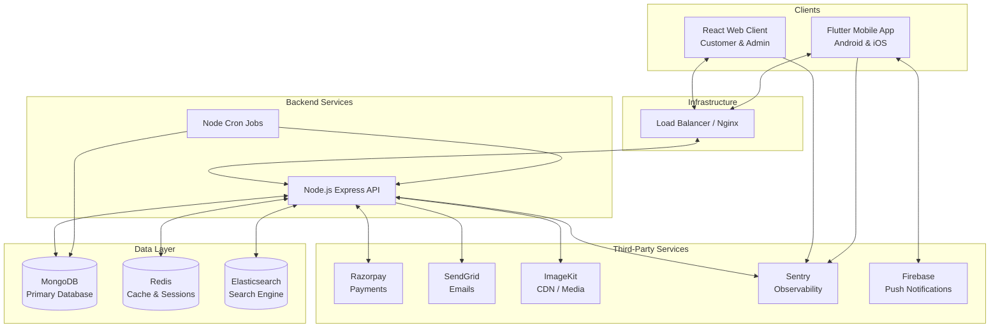

# System Architecture

## High-Level Architecture Diagram

## Component Interactions

1. **Client-to-API Flow**: Both the Web Client and the Mobile App communicate with the Node.js Backend via standard HTTP REST endpoints. Authentication is handled via JWT tokens passed in the `Authorization` header.
2. **Search Flow**: When a user searches for products, the query is routed to Elasticsearch instead of MongoDB to ensure fast text matching and filtering. The backend is responsible for keeping Elasticsearch indexes in sync with the primary MongoDB database.
3. **Caching Strategy**: Redis is utilized to cache heavy API responses and frequently accessed data to reduce the load on MongoDB and decrease response times.
4. **Media Handling**: Images uploaded by vendors/admins are processed by the backend and stored/served via ImageKit (and potentially Cloudinary for the mobile app) to ensure fast CDN delivery to end users.

## Deployment Architecture
The platform is containerized using Docker. The `docker-compose.yml` defines the multi-container setup, primarily handling the backend (`smitox-server`) and frontend (`smitox-client`) services over a bridged network (`smitox-net`). The database and cache services are either hosted externally (e.g., MongoDB Atlas, Upstash) or running on the host machine.
