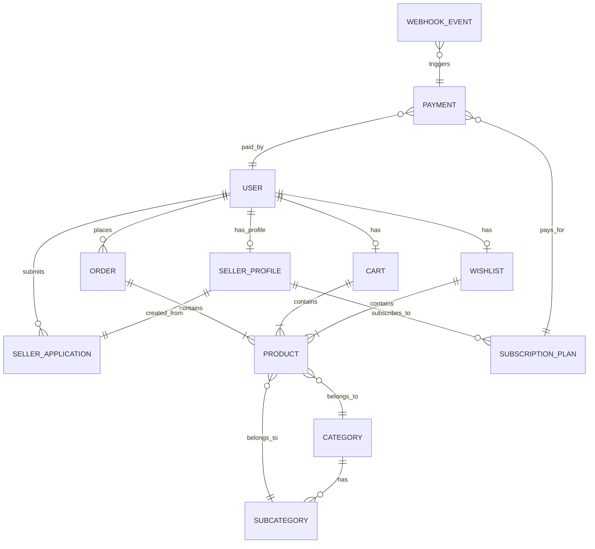

# Database Schema Analysis

This document details the MongoDB schemas used in the Smitox platform, defined via Mongoose.

## Entity Relationship Diagram

---

## 1. Core E-Commerce Models

### `Product` (productModel.js)
The central entity for the marketplace.
- **Key Fields:**
  - `name`, `slug`, `description`
  - `price`, `mrp`, `perPiecePrice`, `totalsetPrice`
  - `category` (ObjectId -> Category), `subcategory` (ObjectId -> SubCategory)
  - `stock`, `quantity`
  - `images`, `photos` (Cloudinary integration)
  - `sku` (Automatically generated using `generateSKU` method based on name/category initials)
  - `bulkProducts` (Embedded Array): Defines pricing tiers based on minimum/maximum quantity.
  - `custom_order` (Managed by `CustomOrderService` for manual sorting)
- **Indexes:** Text index on `name` for search optimization.

### `Category` & `SubCategory` (categoryModel.js, subcategoryModel.js)
- **Category:** Contains `name`, `slug`, `photos` (Cloudinary URL).
- **SubCategory:** Belongs to a Category (`category` ObjectId ref).

### `Order` (orderModel.js)
Tracks purchases made by users.
- **Key Fields:**
  - `buyer` (ObjectId -> User)
  - `products`: An array of snapshots. Captures `product`, `quantity`, `price`, `unitPrice`, `taxAmount`, `totalAmount`, `productName`, `productImage` *at the time of the order* so future price changes don't affect past orders.
  - `payment`: Embedded doc with `paymentMethod` ("COD", "Razorpay", "Advance") and `transactionId`.
  - `status`: Enum from "Pending" to "Delivered"/"Returned".
  - `amount`, `deliveryCharges`, `codCharges`, `discount`.
- **Indexes:** `payment.transactionId` and `payment.razorpayPaymentId`.

### `Cart` & `Wishlist` (cartModel.js, wishlistModel.js)
- Simple junction collections mapping a `User` ObjectId to an array of `Product` ObjectIds and `quantities`.

---

## 2. User & Access Management Models

### `User` (userModel.js)
A massive, unified collection that stores both Customer and Admin/Seller data.
- **Customer Fields:** `mobile_no`, `email_id`, `password`, `user_fullname`, `address`, `city`, `state`, `pincode`.
- **Seller Specific Fields:** `gst_no`, `pan_no`, `gst_image`, `company`, `account_no`, `ifsccode`.
- **Cart/Wishlist Embedded:** Arrays of references to Products.
- **RBAC (Role Based Access Control):**
  - `roleString`: "user", "admin", "seller", "super_admin".
  - `permissions`: Embedded document with `grantedCapabilities` and `deniedCapabilities` arrays for fine-grained access control.
- **Indexes:** `{ roleString: 1, isActive: 1 }`, `{ lastLogin: -1 }`.

---

## 3. Seller Onboarding & Monetization Models

### `SellerApplication` (sellerApplicationModel.js)
Tracks the complex KYC and onboarding flow of a vendor.
- **State Machine:** `status` flows through `draft` -> `submitted` -> `under_review` -> `approved_pending_payment` -> `active`.
- **Fields:** Stores KYC documents (`identityProofType`, `identityProofImage`, GST, PAN), Business Info, and Banking details.
- **Snapshotting:** `selectedPlanSnapshot` captures the subscription plan details at the time of application to prevent discrepancies if the plan price changes later.

### `SellerProfile` (sellerProfileModel.js)
Created upon successful application approval. Separates public business metrics from the private User document.
- **Metrics:** `totalProducts`, `totalOrders`, `totalRevenue`, `averageRating`.
- **Financials:** `walletBalance`, `commissionRate`.
- **Subscription Tracking:** `currentPlanId`, `planActivatedAt`, `subscriptionStatus`, `paymentAttempts` array.

### `SubscriptionPlan` & `Payment` (paymentModel.js)
- **Payment:** Tracks Razorpay/Stripe transactions. Fields include `razorpayOrderId`, `amount`, `status`, `paymentMethod`.
- **Indexes:** `userId`, `razorpayOrderId`, `status`.

---

## 4. System & Reliability Models

### `WebhookEvent` (webhookEventModel.js)
Implements an idempotency and retry mechanism for third-party webhooks (e.g., Razorpay callbacks).
- **Fields:** `eventId` (Unique), `provider`, `eventType`, `payload` (Raw).
- **Retry Logic:** Tracks `processingAttempts`, `nextRetryAt`, and `status` (`pending`, `failed`, `completed`).
- **Indexes:** Includes a TTL index that automatically deletes webhook logs after 90 days.
