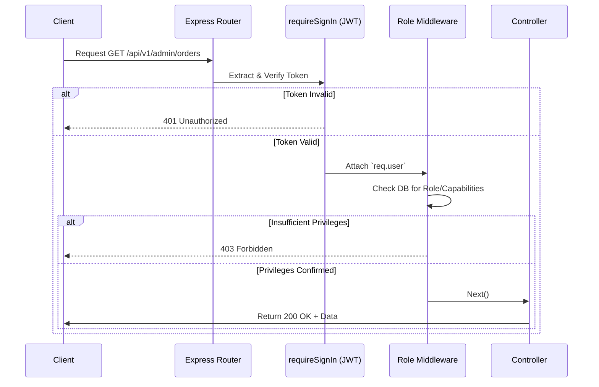

# Routing Flow & Middleware Security

The Express backend utilizes a rigorous middleware chain to ensure that routes are protected, roles are verified, and data is sanitized before reaching the controllers.

## Middleware Execution Flow



## Core Middlewares (`server/middlewares/authMiddleware.js`)

### 1. `requireSignIn`
The foundational security layer.
- **Action**: Extracts the JWT token from the `Authorization` header.
- **Validation**: Uses `jsonwebtoken.verify` with `JWT_SECRET`.
- **Injection**: If valid, decodes the user payload and attaches it to `req.user` for downstream consumption.

### 2. `isAdmin`
Role-based check for the legacy Admin system.
- **Action**: Queries the `User` model using `req.user._id`.
- **Validation**: Checks if `user.role === 1` or `user.roleString === 'admin'`.

### 3. `isSeller`
Role-based check for the Vendor platform.
- **Action**: Queries the `User` model using `req.user._id`.
- **Validation**: Checks if `user.role === 2` or `user.roleString === 'seller'`.

### 4. `requireCapability(capability)` (Granular RBAC)
Modern RBAC introduced for fine-grained permissions (likely replacing the legacy `role === 1` checks).
- **Action**: Expects a string capability (e.g., `'products:write'`, `'sellers:moderate'`).
- **Validation**:
  1. Checks if the capability is explicitly in `user.permissions.deniedCapabilities`. If so, hard blocks.
  2. Checks if the capability is in `user.permissions.grantedCapabilities` OR if the user is a `super_admin`.

## File Upload Middleware (`formidable` & `multer`)
Routes that handle images (like `/create-product` or `/create-category`) utilize `express-formidable` or `multer`.
- **Action**: Parses `multipart/form-data`.
- **Output**: Attaches standard text fields to `req.fields` and files to `req.files`.
- **Integration**: The controller then typically reads the file from disk/memory and uploads it to Cloudinary/ImageKit, saving the returned URL to the database.

## Route Definitions
Routes are mounted in `server.js` using prefix paths:
```javascript
app.use('/api/v1/auth', authRoutes);
app.use('/api/v1/product', productRoutes);
app.use('/api/v1/category', categoryRoutes);
app.use('/api/v1/search', searchRoutes);
// ...
```
