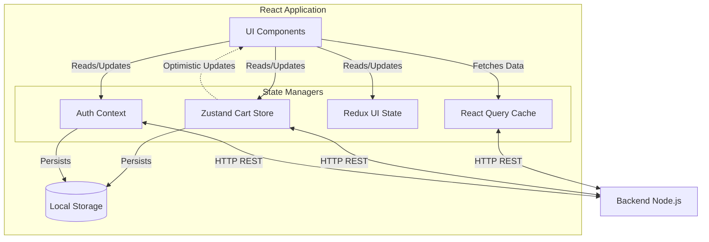

# Frontend State Management

The React web application uses a **hybrid state management architecture**. Over time, the project has evolved and incorporated multiple tools to handle different types of state.

## 1. Authentication State (Context API)
`client/src/context/auth.jsx`

Authentication is the most critical global state and is managed purely through React's native Context API.
- **State Stored**: User object, JWT Token, Refresh Token, Session ID.
- **Persistence**: Automatically synced to `localStorage("auth")` to persist sessions across reloads.
- **Axios Interceptors**: The Context provider explicitly configures an Axios instance (`api`) to inject the `Authorization` header automatically into every request. It also includes an automatic retry mechanism for 401 Unauthorized errors by calling a `/refresh-token` endpoint.
- **Auto Refresh**: Includes logic to decode the JWT, read the expiry (`exp`), and set a `setTimeout` to automatically fetch a new token right before the current one expires.

## 2. E-Commerce State (Zustand)
`client/src/store/cart.store.js`, `wishlist.store.js`

The shopping cart and wishlist states are managed using **Zustand**. This provides a much lighter alternative to Redux for complex interactive state.
- **Persistence**: Uses Zustand's `persist` middleware (`name: 'cart-storage'`) to save cart items locally.
- **Optimistic UI Updates**: Actions like `addToCart`, `removeFromCart`, and `increaseQuantity` update the local Zustand state *immediately* before making the API call to the backend. If the backend call fails, the state is gracefully rolled back to its previous version. This ensures the UI feels extremely fast and responsive.
- **Complex Logic Handling**: The cart store dynamically calculates bulk pricing right in the frontend using the `getPriceForProduct` helper. If a user adds enough quantity to meet a `bulkProducts` tier, the price updates automatically.

## 3. Global UI State (Redux Toolkit)
`client/src/redux/store.js`

There is a legacy or specialized Redux implementation using `@reduxjs/toolkit`.
- **Usage**: Primarily used for UI-specific global state, such as tracking scroll positions (`scrollSlice.js`).
- **Reasoning**: Likely kept around for legacy compatibility, while newer feature development shifted towards Zustand and React Query.

## 4. Server State (React Query)
`client/src/package.json` shows `@tanstack/react-query` is installed.
While auth and cart are managed manually, React Query is heavily utilized for fetching, caching, and synchronizing asynchronous data (like product lists and category data) from the Express backend, reducing the need for complex Redux thunks.

---

