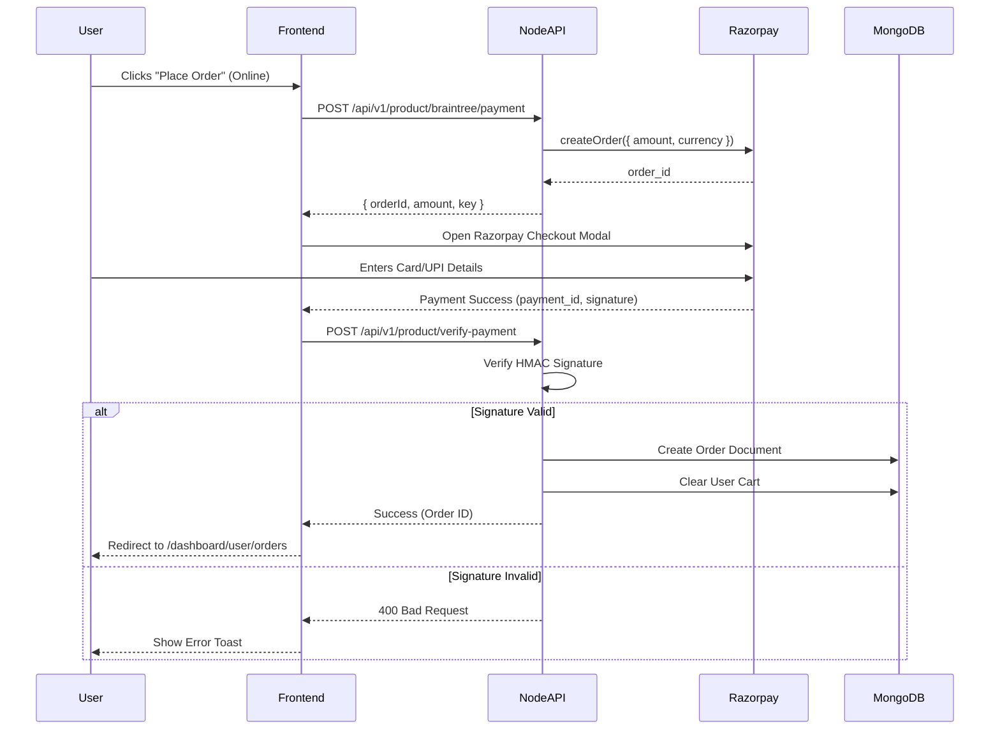

# Checkout & Payment Flow

This document maps out the end-to-end flow of placing an order on the Smitox platform.

## Entry Point
`client/src/pages/cart/CartPage.jsx`

## 1. Frontend Flow
1. User navigates to their Cart.
2. The UI renders items from the Zustand `cartStore`.
3. User confirms their shipping address.
4. User selects a payment method: **COD** (Cash on Delivery) or **Razorpay** (Online Payment).
5. User clicks `[Place Order]`.

## 2. API Flow

## 3. Database Impact (Snapshotting)
When the order is created in MongoDB (`orderModel.js`), the backend **snapshots** the product details.
Instead of just saving the `productId`, the system copies:
- `unitPrice`
- `taxAmount`
- `productName`
- `productImage`

*Why?* If a seller changes the price of a product tomorrow, or deletes the image, the historical order receipt must remain completely unaffected.

## 4. Failure Recovery
- **Dropped Internet**: If the user's internet drops during the Razorpay modal, the payment will be marked as 'failed' or 'abandoned' in the Razorpay dashboard. No order is created in MongoDB.
- **Webhook Fallback**: The system includes a webhook listener (`/api/v1/webhooks/razorpay/success`). If the frontend fails to call `/verify-payment` (e.g., user closes the tab too fast), Razorpay will ping the webhook server-to-server, which will create the order asynchronously.
