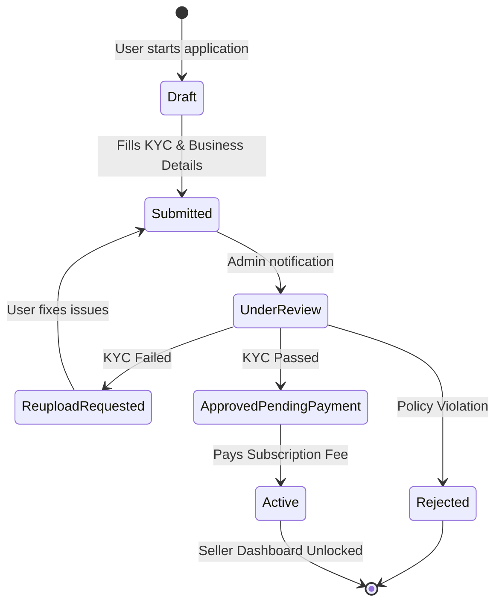

# Seller Onboarding Flow

This feature allows a standard Customer to upgrade their account to a Vendor/Seller by passing KYC and purchasing a subscription plan.

## Entry Point
`client/src/pages/Seller/Apply.jsx`

## 1. Flow Stages

## 2. API Lifecycle
1. **Save Draft**: `POST /api/v1/seller-application/`
2. **Admin Review**: Admin sees the application in their dashboard.
3. **Approval**: Admin clicks `[Approve]`. API `PUT /api/v1/seller-application/:id/approve` is called.
4. **Subscription Snapshot**: The backend reads the currently `selectedPlanId`, and copies its exact price and features into `selectedPlanSnapshot`. This ensures the vendor pays exactly what they were quoted, even if admin changes plan prices.
5. **Payment**: The vendor is notified to pay. They go through the Razorpay checkout.
6. **Activation**: Upon payment success, `SellerProfile` is created, `User.roleString` becomes `seller`, and `User.permissions.grantedCapabilities` are populated based on the chosen subscription plan.

## 3. Data Entities Touched
- `SellerApplication`: Stores the raw form data and KYC images.
- `SellerProfile`: Stores the live store details (Wallet, Rating, Total Sales).
- `User`: RBAC roles are elevated.
- `Payment`: Records the Razorpay transaction for the subscription fee.
