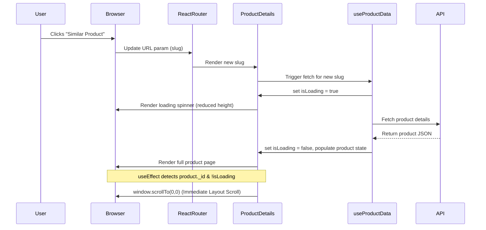
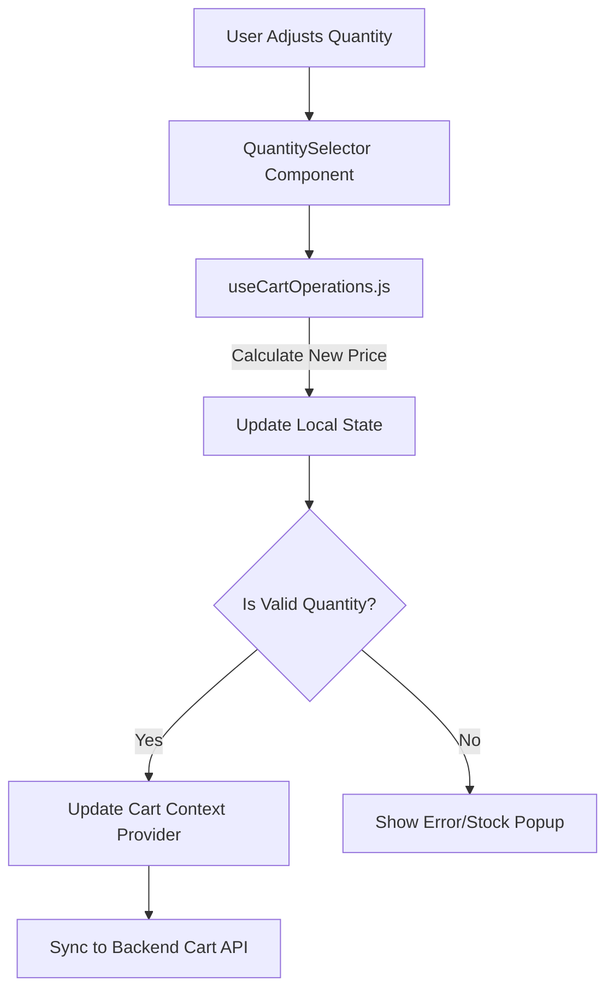
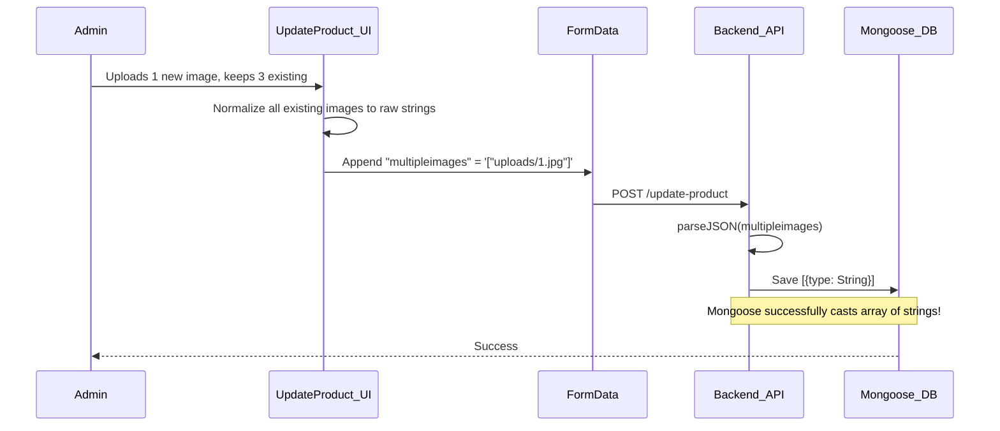

# State Management Report

## Overview
The Smitox platform relies heavily on React hooks and contextual state management for handling data flow across different pages, specifically from product listings to cart operations and administrative updates.

## 1. Product Detail State Flow
The product details view fetches product data using custom hooks (`useProductData`, `useUIState`, `useCartOperations`) and carefully manages UI loading states. A critical issue resolved involved scroll restoration behaving improperly during concurrent React renders when `isLoading` toggled the DOM height.



## 2. Cart & Quantity State Flow
When a user updates a quantity, `useCartOperations` debounces or immediately calculates price logic on the client side, then commits to the backend and React Context.



## 3. Admin Panel Image Deletion Root Cause
A critical data structure casting issue caused images to mysteriously disappear when an admin updated a product.

### The Root Cause:
1. Some products had their `multipleimages` field stored as stringified JSON objects (`{"url": "uploads/..."}`).
2. On `UpdateProduct.jsx`, `getSingleProduct` fetched these arrays. It evaluated `typeof img === 'object'` (from JSON parsing) and returned `{url: "uploads/..."}` directly instead of extracting the string.
3. When the Admin clicked **Update**, `FormData` serialized the state as an array of objects `[{"url":"..."}]`.
4. The server backend received this data and parsed it back into objects.
5. Mongoose's schema is strictly defined as `[{type: String}]`. When Mongoose attempted to cast an object `{url: "..."}` to a String, it failed and silently dropped the object, causing the DB to be updated with `[]` or `null` entries.

### The Fix:
A robust normalization filter was introduced in `UpdateProduct.jsx` to strictly cast and map all items to strings:
```javascript
if (typeof img === 'object' && img !== null) {
  return img.url || '';
}
```
This guarantees the payload is always an array of pure URL strings.


